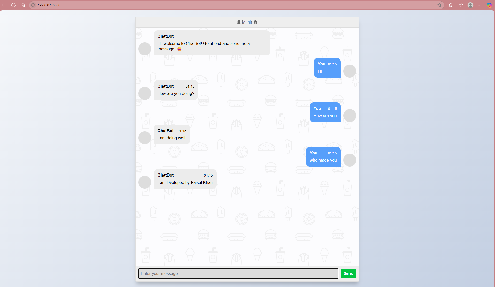

# 🤖 Mimir - AI Chatbot Web App


**"A minimalist AI companion built with Flask & ChatterBot."**

**Mimir** is a sleek, modern chatbot web app using **Flask (Python)**, **ChatterBot**, and **Bootstrap 5**. It allows users to chat with an AI bot in real-time via a clean, animated UI with a dark aesthetic — no white anywhere.

---

## 🌐 View Live Project

👉 [Mimir Chatbot Live](https://mimir-r2z1.onrender.com/)

---

## ✨ Features

- **💬 Real-time Chatbot:** Talk to Mimir, a conversational AI powered by ChatterBot.
- **🎨 Dark Mode UI:** Cool modern design with gradients, soft shadows, and no white.
- **🌀 Smooth Animations:** Fade-ins, transitions, and minimal interaction effects.
- **🖼️ Background Graphics:** Light SVG patterns with modern design elements.
- **📱 Responsive Layout:** Perfect on mobile, tablet, and desktop.
- **📌 Fixed Footer:** Footer with developer links and social profiles.

---

## 📁 Project Structure

```
mimir_chatbot/
├── app.py                  # Flask backend
├── chatbot.py              # ChatterBot logic and training
├── db.sqlite3              # ChatterBot's SQLite database
├── requirements.txt        # Python dependencies
├── vercel.json             # Vercel deployment configuration
├── README.md               # Project documentation
├── templates/
│   └── index.html          # Main chat interface
└── static/
    └── styles/
        └── style.css       # Theme styles & animations
```

---

## 🧪 Setup & Installation

1. **Clone the repository**:

```bash
git clone https://github.com/khanfaisal79960.Mimir.git
cd Mimir
```

2. **Create a virtual environment**:

```bash
python -m venv venv
```

3. **Activate the environment**:

- **Windows:** `venv\Scripts\activate`
- **macOS/Linux:** `source venv/bin/activate`

4. **Install dependencies**:

```bash
pip install -r requirements.txt
```

5. **Run the application**:

```bash
python app.py
```

6. **Open in browser**:  
Visit `http://127.0.0.1:5000`

---

## 🖼️ Screenshots

> Replace with your actual UI screenshots in the static/images/ folder



---

## 👨‍💻 Developer

**Faisal Khan**

- 🌐 [Portfolio](https://khanfaisal.netlify.app)
- 💻 [GitHub](https://github.com/khanfaisal79960)
- 🔗 [LinkedIn](https://www.linkedin.com/in/khanfaisal79960)
- ✍️ [Medium](https://medium.com/@khanfaisal79960)
- 📷 [Instagram](https://instagram.com/mr._perfect_1004)

---

> Crafted with 💙 by Faisal Khan.
